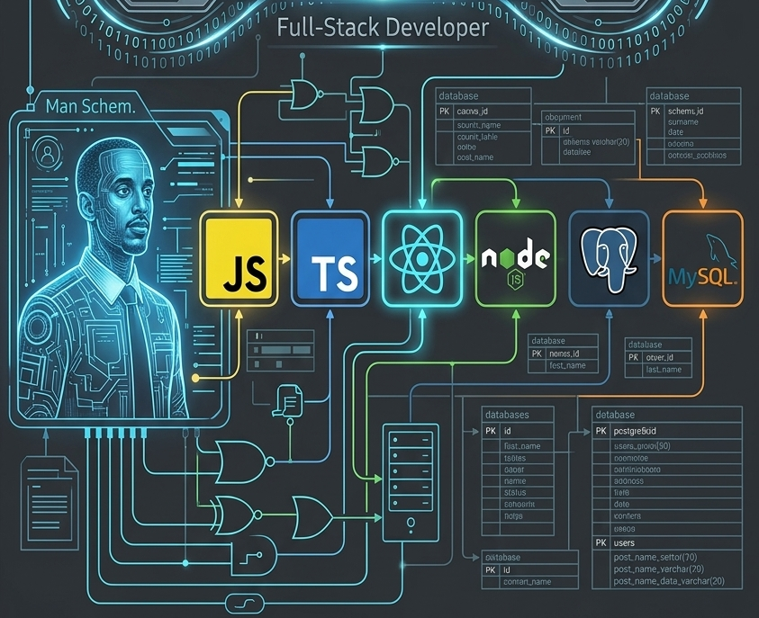

  

<h1 align="center">👋 Hi, I'm Amanuel </h1>

  A Full-Stack Software Engineer Crafting robust backend architectures, dynamic type-safe frontends, and high-performance databases. 
  From responsive UI/UX to scalable relational and serverless data layers — built for speed, reliability, and scale.

---

## 🚀 Technical Core Stack

| Layer         | Technologies                                              |
| ------------- | --------------------------------------------------------- |
| **Languages** | JavaScript (ES6+), TypeScript, SQL, HTML5, CSS3 / Sass    |
| **Frontend**  | React.js, Vite, Tailwind CSS, Bootstrap, Context API      |
| **Backend**   | Node.js, Express.js, RESTful APIs, Axios Interceptors     |
| **Databases** | PostgreSQL, MySQL, Firebase, Supabase, Query Optimization |

---

## 🛠️ Featured Portfolio & Architecture Projects

### 💼 Automated Garage Management System

> A complete operational management application for auto repair shops and vehicle service facilities.

- ▸ Interactive multi-step workflows and dynamic form configuration for custom services
- ▸ Integrated modules for safety systems and vehicle ADAS camera calibrations
- ▸ `React` `Node.js` `Express` `PostgreSQL` `Bootstrap` `Context API`

---

### 💬 Student Discussion & Q&A Forum Platform

> A full-stack knowledge-sharing marketplace modeled after professional peer-to-peer forums.

- ▸ Highly optimized one-to-many relational schemas linking questions, answers, and user profiles
- ▸ Server-side full-text search and real-time content updates
- ▸ `React` `Node.js` `MySQL` `Express`

---

### 🎬 Full-Scale Entertainment & Streaming Clone

> A performance-optimized frontend clone replicating a premium streaming platform interface.

- ▸ Robust client-side global state management with seamless TMDB REST API integration
- ▸ Centralized authentication wrappers using custom Axios interceptors
- ▸ `React.js` `Vite` `Tailwind CSS` `Axios`

---

### 🛒 E-Commerce Showcase Platform

> A comprehensive, full-stack replication of an enterprise e-commerce platform.

- ▸ Dynamic product listings and fully responsive cart components
- ▸ Industry-standard layout structures with clean state tracking throughout the user flow
- ▸ `React` `Node.js` `Express` `Relational Database Design`

---

## ⚙️ Development Principles & Best Practices

- **🔷 Type Safety First** — Writing explicit, robust TypeScript declarations to eliminate runtime errors and maintain self-documenting codebases.
- **🔷 Data Integrity & Optimization** — Architecture of relational databases with clean normalization, declarative constraints, and indexing for rapid query execution and reliable migrations.
- **🔷 Component-Driven UI/UX** — Constructing reusable, highly responsive layouts using atomic design concepts and modern utility-first CSS frameworks.

---

## 📫 Let's Connect!

- 💼 **Upwork Profile:** Available for Freelance & Contract Inquiries
- 💬 **Areas of Interest:** Full-Stack Architectures · Relational Schema Optimization · API Engineering · Mobile Development
